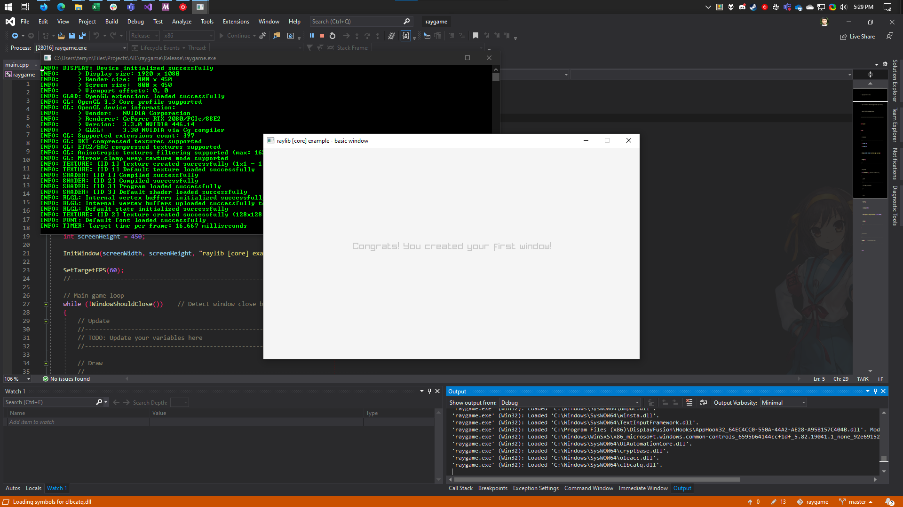

# raygame - sample project

This is a sample C++ project setup with [raylib][raylib] for Visual Studio 2017.
Raylib is a simple game programming framework that is designed to be friendly to
beginners. It is created by [Ramon Santamaria (@raysan5)][raysan].

It is primarily intended for use by students in the Game Programming course at
the Seattle Campus of the Academy of Interactive Entertainment.

[raylib]:https://github.com/raysan5/raylib
[raysan]:https://github.com/raysan5

## Building

This project supports by **Visual Studio 2017** or newer.

Clone the repository and open the solution in Visual Studio. Both the solution
and project should already be configured and ready to start working with. To
test this, build and run the provided sample project.

The sample project that is provided is the [basic window example][basicexample]
from raylib. Further examples can be found in its [repository][rayexample] or
on the [website][rayexamplesite].

You can review the [cheatsheet][raycheat] for the full range of functions made
available through raylib.

[basicexample]:https://github.com/raysan5/raylib/blob/master/examples/core/core_basic_window.cpp
[rayexample]:https://github.com/raysan5/raylib/tree/master/examples
[rayexamplesite]:https://www.raylib.com/examples.html
[raycheat]:https://www.raylib.com/cheatsheet/cheatsheet.html

## License

MIT License - Copyright (c) 2018 Academy of Interactive Entertainment

For more information, see the [license][lic] file.

Third party works are attributed under [thirdparty.md][3p].

[lic]:license.md
[3p]:thirdparty.md
[raylib]:https://github.com/raysan5/raylib